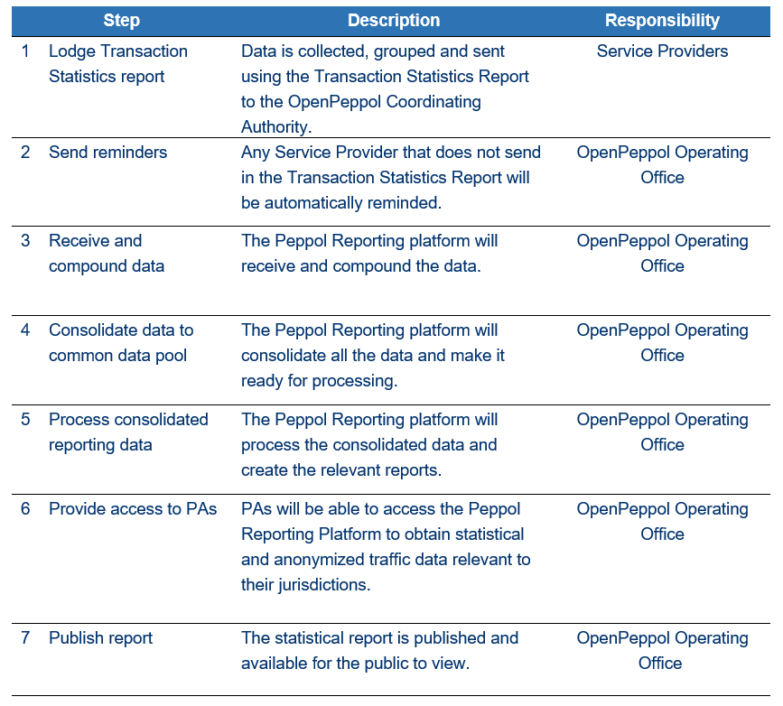

= Business processes

== Introduction

Statistical reporting of production data helps the Peppol Coordinating Authority and PAs to monitor the operations of the Peppol Network and identify and manage risks and issues within the network.
The reporting requirements towards SPs are divided into two areas: reporting about End User data and reporting about Transaction Statistics. This operational procedure will explain and outline the operational procedures for each of these reporting areas.
The policy on reporting is stated in Internal Regulations for Use of the Peppol Network.

=== End User Reporting

==== Process Overview

The following diagram provides an overview of the key steps when Service Providers are reporting monthly End User Data. The diagram is a general representation of the process flow; some steps can be undertaken in parallel and do not need to be completed in strict order.

image::./images/process.png[process, align="center"]

== Procedure steps

=== Lodge End User report

SPs will:

1.	Collect relevant data, taking care with the accuracy and validity of this data.
2.	Report this data in accordance with the Peppol End User Report specification. This interface allows for a standardized and structured dataset from where the Peppol Coordinating Authority can automate processing and aggregation of the data upon receival in the Peppol Reporting Platform.
3.	Ensure all data for a month is reported within 10 calendar days following the end of the month.
4.	Transmit the Peppol End User Report BIS to the Peppol Coordinating Authority in accordance with the Peppol End User Report specification.

=== Send Reminders

The OpenPeppol Operating Office (OO) will:

1.	Automatically check which providers have not submitted their End User Report. This check will be triggered inside the Peppol Reporting Platform.
2.	Prompt any SPs that have not submitted the End User Report.
3.	Prompt the PA of the SP if a SP fails to submit the End User Report in due time after reminders are sent. The PA of the SP will be informed to handle this as a non-compliance issue.
4.	Failure by SPs to provide full and complete reports can be managed in accordance with the Non-compliance Operational Procedure.

=== Receive and Process Data

The OO will:

1.	Receive End User Reports from Service Providers in accordance with the Peppol End User Report specification.
2.	Process the received data inside the Peppol Reporting Platform by aggregating and dividing the data into reports and data sheets for each jurisdiction/Peppol Authority for whom the End User data is relevant.

== Transaction Statistics reporting

=== Process Overview

The following diagram provides an overview of the key steps when Service Providers are reporting monthly Transaction Statistics. The diagram is a general representation of the process flow; some steps can be undertaken in parallel and do not need to be completed in strict order.

== Procedure steps

=== Lodge Transaction Statistics report

Service Providers will:

1.	Collect relevant data, taking care of the accuracy and validity of this data. Data is to be reported and grouped according to the requirements of the Transaction Statistics Report specification.
2.	Report this data in accordance with the Transaction Statistics Report specification. This interface allows for a standardized and structured dataset from where the Peppol Coordinating Authority can automate the handling of the data upon receival in the Peppol Reporting Platform.
3.	Ensure all data for a month is reported within 10 business days following the end of the month.
4.	Transmit the Transaction Statistics Report to the Peppol Coordinating Authority in accordance with the Transaction Statistics Report specification.

=== Send Reminders

The OpenPeppol Operating Office (OO) will:
1.	Automatically check which providers have not submitted their Transaction Statistics Report. This check will be triggered inside the Peppol Reporting Platform.
2.	Prompt any SPs that have not submitted the Transaction Statistics Report.
3.	Prompt the PA of the SP if a SP fails to submit the Transaction Statistics Report in due time after reminders are sent. Their PA will be informed to handle this as a non-compliance issue.
4.	Failure by SPs to provide full and complete reports can be managed in accordance with the https://openpeppol.atlassian.net/wiki/spaces/AF/pages/2756771841/New+Peppol+Agreements+and+accompanying+documents[Non-compliance Operational Procedure].

=== Receive and Compound data

The OpenPeppol Operating Office (OO) will:
1.	Receive Transaction Statistics Reports from Service Providers in accordance with the Transaction Statistics Report specification.
2.	Compound all the data inside the Peppol Reporting Platform preparing it for consolidation.

=== Consolidate data to a common data pool

The OpenPeppol Operating Office (OO) will:
1.	Consolidate all compounded data.
2.	Create a unified data structure and a proper basis for the data processing.

=== Process consolidated reporting data

The OpenPeppol Operating Office (OO) will:
1.	Process the consolidated data by applying agreed rules for report generation.
2.	Analyse the statistical information for any immediate trends and possible issues.
3.	Create a statistical report to be submitted to the MC. Further details which are *not for publication* can be provided to the MC. MC members are bound by confidentiality agreements.
4.	Create statistical reports and data sheets for the PAs. 

=== Provide access to PAs

The OpenPeppol Operating Office (OO) will:
1.	Make sure that the PAs have a secure space where they can log in, access, and download the reports generated by the Reporting Platform in relation to transaction data concerning their respective Jurisdiction.

=== Publish report

The OpenPeppol Operating Office (OO) will:
1.	Publish the statistical report to a publicly accessible location.
Information included in statistical reports is aggregated data and does not identify any end user or service provider or their individualised information or data.
2.	Notify all OpenPeppol Members.
The notification will include a link to the published report.

