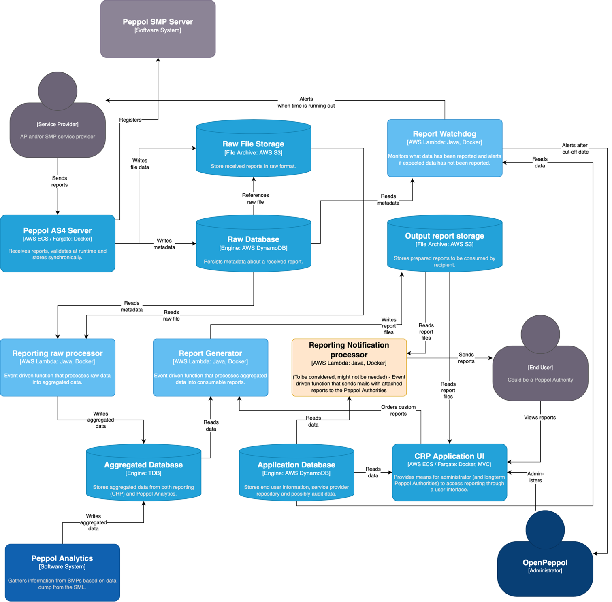

= Business processes

== Parties and roles
Peppol Central Reporting platform (CRP) collects statistics that is sent by the Peppol Service Providers and aggregates the collected data into reports that are submitted to OpenPeppol and later also the Peppol Authorities.
The diagram below shows the roles involved in the reporting transactions. 

=== Parties

Customer::
The customer is the legal person or organisation who is in demand of a product or service. Examples of customer roles: buyer, consignee, debtor, contracting authority.

Supplier::
The supplier is the legal person or organisation who provides a product or service.

=== Roles

Creditor::
One to whom a debt is owed. The party that claims the payment and is responsible for resolving billing issues and arranging settlement. The party that sends the invoice or credit note. Also known as invoice issuer, accounts receivable or seller.

Debtor::
One who owes debt. The party responsible for making settlement relating to a purchase. The party that receives the invoice or credit note. Also known as invoicee, accounts payable, or buyer.
== PINT Billing process

The invoicing process includes issuing and sending the invoice and the credit note from the supplier to the customer and the reception  and handling of the same at the customer’s site.

The invoicing process is shown in this workflow:

* A supplier issues and sends an invoice to a customer. The invoice refers to one order and a specification of delivered goods and services.

An invoice may also refer to a contract or a frame agreement. The invoice may specify articles (goods and services) with article number or article description.

* The customer receives the invoice and processes it in the invoice control system leading to one of the following results:
  .. The customer fully approves the invoice, posts it in the accounting system and passes it on to be paid.
  .. The customer completely rejects the invoice, contacts the supplier and requests a credit note.
  .. The customer disputes parts of the invoice, contacts the supplier and requests a credit note and a new invoice.

The diagram below shows the basic invoicing process with the use of this PEPPOL BIS profile. This process assumes that both the invoice and the credit note are exchanged electronically.

This profile covers the following invoice processes:

[horizontal]
P1:: Invoicing of deliveries of goods and services against purchase orders, based on a contract
P2:: Invoicing deliveries of goods and services based on a contract
P3:: Invoicing the delivery of an incidental purchase order
P4:: Pre-payment
P5:: Spot payment
P6:: Payment in advance of delivery
P7:: Invoices with references to a despatch advice
P8:: Invoices with references to a despatch advice and a receiving advice
P9:: Credit notes or invoices with negative amounts, issued for a variety of reasons including the return of empty packaging

== Invoice functionality

An invoice may support functions related to a number of related (internal) business processes. This Peppol BIS shall support the following functions:

* Accounting
* Invoice verification against the contract, the purchase order and the goods and service delivered
* Tax reporting
* Auditing
* Payment

In the following chapters an assessment is made of what information is needed for each of the functions listed above and whether it is in scope or out of scope for this Peppol BIS.

Explicit support for the following functions (but not limited to) is out of scope: 

* Inventory management
* Delivery processes
* Customs clearance
* Marketing
* Reporting

=== Accounting

Recording a business transaction into the financial accounts of an organization is one of the main objectives of the invoice. According to financial accounting best practice and CT rules every Taxable person shall keep accounts in sufficient detail for CT to be applied and its application checked by the tax authorities. For that reason, an invoice shall provide for the information at document and line level that enables booking on both the debit and the credit side.

=== Invoice verification

This process forms part of the Buyer’s internal business controls. The invoice shall refer to an authentic commercial transaction. Support for invoice verification is a key function of an invoice. The invoice should provide sufficient information to look up relevant existing documentation, electronic or paper, for example, and as applicable:

* the relevant purchase order
* the contract
* the call for tenders, that was the basis for the contract
* the Buyer’s reference
* the confirmed receipt of the goods or services
* delivery information

An invoice should also contain sufficient information that allows the received invoice to be transferred to a responsible authority, person or department, for verification and approval.

An invoice may support functions related to a number of related (internal) business processes. This Peppol BIS shall support the following functions:

* Accounting
* Invoice verification against the contract, the purchase order and the goods and service delivered
* Tax reporting
* Auditing
* Payment

In the following chapters an assessment is made of what information is needed for each of the functions listed above and whether it is in scope or out of scope for this Peppol BIS.

Explicit support for the following functions (but not limited to) is out of scope: 

* Inventory management
* Delivery processes
* Customs clearance
* Marketing
* Reporting

=== Tax Reporting

The invoice is used to carry Tax related information from the Seller to the Buyer to enable the Buyer and Seller to correctly handle Tax booking and reporting. An invoice should contain sufficient information to enable the Buyer and any auditor to determine whether the invoice is correct from a Tax point of view.

The invoice shall allow the determination of the Tax regime, the calculation and description of the tax, in accordance with the {Tax-dir} and subsequent amendments.

=== Payment

An invoice represents a claim for payment. The issuance of an invoice may take place either before or after the payment is carried out. When an invoice is issued before payment it represents a request to the Buyer to pay, in which case the invoice commonly contains information that enables the Buyer, in the role of a debtor, to correctly initiate the transfer of the payment, unless that information is already agreed in prior contracts or by means of payment instructions separately lodged with the Buyer.

If an invoice is issued after payment, such as when the order process included payment instructions or when paying with a credit card, online or telephonic purchases, the invoice may contain information about the payment made in order to facilitate invoice to payment reconciliation on the Buyer side. An invoice may be partially paid before issuing such as when a pre-payment is made to confirm an order.

Invoices, conformant with this specification should identify the means of payment for settlement of the invoice and clearly state what payment amount is requested. They should provide necessary details to support bank transfers. Payments by means of Credit Transfer, Direct debit, and Payment Card are in scope.

=== Negative invoices and credit notes

The negative invoice is usually used to correct a mistake or give a credit to the customer. 

Standard Japanese invoice (document type code:380) is usually used as the negative invoice, instead of Credit Note (document type code: 381). 

However, there are some cases where the Credit Note is used as the negative invoice. For instance, Japanese businesses would receive the Credit Note as the negative invoice issued by foreign businesses. 

== BIS Identifiers

Peppol has defined a {policy8} that specifies how to use identifiers in both its transport infrastructure and within the documents exchanged across that infrastructure. It also introduces
principles for any identifiers used in the Peppol environment. The policies that apply to this BIS are the following:

=== Profiles and messages [[profiles]]

All messages contains Business process type (IBT-23) and Specification identifier (IBT-24). Business process type (IBT-23) identifies what business process a given message is part of, and Specification identifier (IBT-24) identifies the kind of message and the rules applied.

Profiles are connected to one business process, and may contain multiple document types. Valid document instances shall contain corresponding Business process type (IBT-23) and Specification identifier (IBT-24).

IMPORTANT: Specification identifier (IBT-24) is a string without spaces. The list below contains spaces in Specification identifier (IBT-24) to make them easier to read. *Make sure to remove any spaces before use.*

In the table below you will find the values to be used as the specification identifier (IBT-24) and the business process type (IBT-23) for this profile

[cols="2s,5a,5a", options="header"]
|===
| Type
| Element `cbc:CustomizationID`
| Element `cbc:ProfileID`

| Reporting
| urn:peppol:pint:reporting-3.0
| urn:fdc:peppol.eu:2017:poacc:reporting:01:1.0

|===

.UBL example of profile identifier
[source, xml, indent=0]
----
rem include::../../../alignments/bis/snippets/Snippet-Full.xml[tags=profile]
----

:leveloffset: +1

rem include::../../../alignments/bis/doc-section/local-processes.adoc[]

:leveloffset: -1