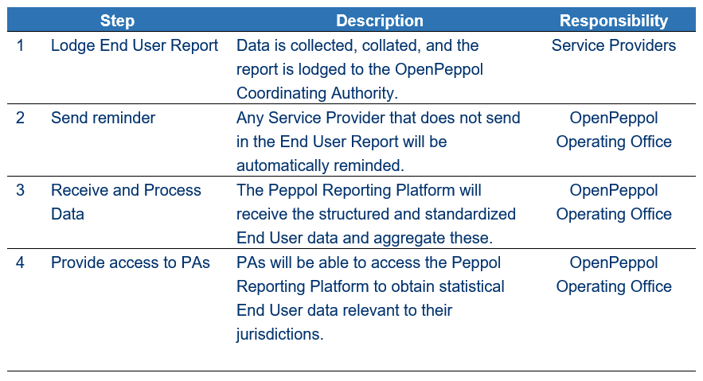

= Business processes

This document sets out the processes and procedures for reporting data in the Peppol environment.

This includes:

* *Service Provider (SP) reporting*
    - how SPs are to submit reports on their End Users and statistical reports on transactions to the Peppol Coordinating Authority. 
* *Peppol Authority (PA) access* 
    - how PAs can access and download the information from the Peppol Coordinating Authority.
* *Peppol Coordinating Authority reports* 
    - how the Peppol Coordinating Authority will make consolidated statistical reports available for public consumption.
== Out of scope

* *PA usage* - how PAs will use and share statistical information/reports is managed by each PA.
* *Local or regional domains* - reporting of information for activities within local or regional domains is the responsibility of the PAs owners of those domains. Local and regional domains are required to keep the Peppol Coordinating Authority informed of its activities.
* *Operational reports* - Management reports relating to workloads and workflow (e.g. change requests, extended use requests, issues and incidents, non-compliance, etc.) are managed by the OpenPeppol Operating Office as part of its operations.

== Introduction

Statistical reporting of production data helps the Peppol Coordinating Authority and PAs to monitor the operations of the Peppol Network and identify and manage risks and issues within the network.
The reporting requirements towards SPs are divided into two areas: reporting about End User data and reporting about Transaction Statistics. This operational procedure will explain and outline the operational procedures for each of these reporting areas.
The policy on reporting is stated in Internal Regulations for Use of the Peppol Network.

=== End User Reporting

==== Process Overview

The following diagram provides an overview of the key steps when Service Providers are reporting monthly End User Data. The diagram is a general representation of the process flow; some steps can be undertaken in parallel and do not need to be completed in strict order.

== Procedure steps

=== Lodge End User report

SPs will:

1.	Collect relevant data, taking care with the accuracy and validity of this data.
2.	Report this data in accordance with the Peppol End User Report specification. This interface allows for a standardized and structured dataset from where the Peppol Coordinating Authority can automate processing and aggregation of the data upon receival in the Peppol Reporting Platform.
3.	Ensure all data for a month is reported within 10 business days following the end of the month.
4.	Transmit the Peppol End User Report BIS to the Peppol Coordinating Authority in accordance with the Peppol End User Report specification.

=== Send Reminders

The OpenPeppol Operating Office (OO) will:

1.	Automatically check which providers have not submitted their End User Report. This check will be triggered inside the Peppol Reporting Platform.
2.	Prompt any SPs that have not submitted the End User Report.
3.	Prompt the PA of the SP if a SP fails to submit the End User Report in due time after reminders are sent. The PA of the SP will be informed to handle this as a non-compliance issue.
4.	Failure by SPs to provide full and complete reports can be managed in accordance with the Non-compliance Operational Procedure.

=== Receive and Process Data

The OO will:

1.	Receive End User Reports from Service Providers in accordance with the Peppol End User Report specification.
2.	Process the received data inside the Peppol Reporting Platform by aggregating and dividing the data into reports and data sheets for each jurisdiction/Peppol Authority for whom the End User data is relevant.

== Transaction Statistics reporting

=== Process Overview

The following diagram provides an overview of the key steps when Service Providers are reporting monthly Transaction Statistics. The diagram is a general representation of the process flow; some steps can be undertaken in parallel and do not need to be completed in strict order.

image::../images/TXStatProcessOverview.png[process, align="center"]

== Procedure steps

=== Lodge Transaction Statistics report

Service Providers will:

1.	Collect relevant data, taking care of the accuracy and validity of this data. Data is to be reported and grouped according to the requirements of the Transaction Statistics Report specification.
2.	Report this data in accordance with the Transaction Statistics Report specification. This interface allows for a standardized and structured dataset from where the Peppol Coordinating Authority can automate the handling of the data upon receival in the Peppol Reporting Platform.
3.	Ensure all data for a month is reported within 10 business days following the end of the month.
4.	Transmit the Transaction Statistics Report to the Peppol Coordinating Authority in accordance with the Transaction Statistics Report specification.

Step	Description	Responsibility
1	Lodge End User Report 	Data is collected, collated, and the report is lodged to the OpenPeppol Coordinating Authority. 	Service Providers
2     	Send reminder	Any Service Provider that does not send in the End User Report will be automatically reminded.
OpenPeppol Operating Office
3	Receive and Process Data	The Peppol Reporting Platform will receive the structured and standardized End User data and aggregate these. 	OpenPeppol Operating Office
4	Provide access to PAs	PAs will be able to access the Peppol Reporting Platform to obtain statistical End User data relevant to their jurisdictions.	OpenPeppol Operating Office

