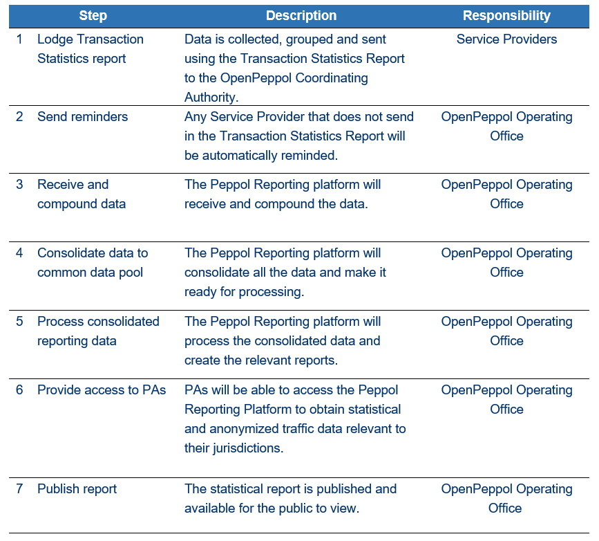

= Introduction

Statistical reporting of production data helps the Peppol Coordinating Authority and PAs to monitor the operations of the Peppol Network and identify and manage risks and issues within the network.
The reporting requirements towards SPs are divided into two areas: reporting about End User data and reporting about Transaction Statistics. This operational procedure will explain and outline the operational procedures for each of these reporting areas.
The policy on reporting is stated in Internal Regulations for Use of the Peppol Network.

== Preface

This {peppol} Reporting provides a set of specifications for implementing a {peppol} business process. The document is concerned with clarifying requirements for ensuring interoperability of pan-European Public eProcurement and provides guidelines for the support and implementation of these requirements.

The purpose of this document is to describe the use of the End User Reporting and Transaction statistics messages in PEPPOL, and to facilitate an efficient implementation and increased use of electronic collaboration regarding the billing process based on these formats.

.Statement of copyright
****
//**This PEPPOL Business Interoperability Specification (PEPPOL BIS) document  is a Core Invoice Usage Specification (CIUS) based on CEN/EN 16931:2017. The restrictions on CEN/EN 16931:2017 implemented in this PEPPOL BIS appear from the conformance statement provided in appendix A.*/

//**The copyright of CEN/EN 16931:2107 is owned by CEN and its members - the European National Standards Bodies. A copy of CEN/EN 16931-1:2017 may be obtained free of charge from any CEN member.*/

OpenPEPPOL AISBL holds the copyright of this PEPPOL BIS, developed and published subject to the conditions of the agreement between the European Commission and CEN allowing derivate works to be developed and distributed with no additional licensing requirements. CEN and the National  Standards Bodies bears no liability from the content and implementation of this PEPPOL BIS.

This PEPPOL BIS document may not be modified, re-distribute, sold or repackaged in any other way without the prior consent of OpenPEPPOL AISBL.
****

== End UserReporting

=== Process Overview

The following diagram provides an overview of the key steps when Service Providers are reporting monthly End User Data. The diagram is a general representation of the process flow; some steps can be undertaken in parallel and do not need to be completed in strict order.

Step	Description	Responsibility
    1	Lodge End User Report 	Data is collected, collated, and the report is lodged to the OpenPeppol Coordinating Authority. 	Service Providers
    2     	Send reminder	Any Service Provider that does not send in the End User Report will be automatically reminded.
OpenPeppol Operating Office
    3	Receive and Process Data	The Peppol Reporting Platform will receive the structured and standardized End User data and aggregate these. 	OpenPeppol Operating Office
    4	Provide access to PAs	PAs will be able to access the Peppol Reporting Platform to obtain statistical End User data relevant to their jurisdictions.	OpenPeppol Operating Office

For further information on PEPPOL/OpenPEPPOL, please see {common}